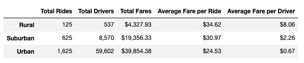
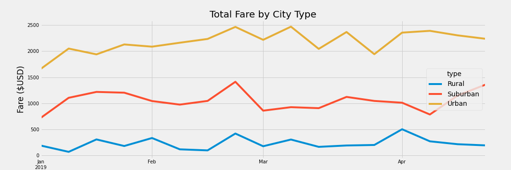

# PyBer Analysis
This analysis showcases the relationships between the number of drivers and riders by city type and the percentage of total fares, drivers, and riders by city type for the year 2019. For the purpose of this analysis, city types are defined as rural, suburban, and urban. These insights will inform PyBer's tactics to expand its business. 

## Results
Results are as follows: 

1. Total rides for rural, suburban, and urban were 125, 625, and 1,625, respectively. 
2. Total drivers for rural, suburban, and urban were 537, 8,570, and 59,602, respectively.
3. Total fares for rural, suburban, and urban were $4,327.93, $19,356.33, and $39,854.38, respectively.
4. Average fare per ride for rural, suburban, and urban was $34.62, $30.97, and $24.53, respectively. 
5. Average fare per driver for rural, suburban, and urban was $8.06, $2.26, and $0.67, respectively. 

6. Total fares for rural, suburban, and urban kept a consistent rank of lowest fare, second to lowest fare, and highest fare, respectively, from January through April, 2019. As seen in the graph below, rural ranged from $0 to $500; suburban ranged from $750 to $1,400; urban ranged from $1,700 to $2,500.  

## Summary 
Based on the results, here are three recommendations to address disparities among city types: 

1. Urban neighborhoods have a staggering 59,602 total drivers serving 1,625 riders. There are sufficient drivers to support higher rider demand, yet a $0.67 average fare per driver will lead to massive turnover if rider demand doesn't pick up soon. PyBer must invest in promotion and advertisement quickly to increase rider demand, retain driver supply, and increase profits in urban neighborhoods. If rider demand generation is not addressed quickly, PyBer may earn a bad reputation with drivers and may be challenged with driver demand generation in the near future. Furthermore, given the fact that urban neighborhoods bring the most business to PyBer, rider demand generation in urban neighborhoods must be the number one priority to ensure business expansion today and in the near future. 

2. Suburban neighborhoods have 8,570 drivers serving 625 riders which lead to an average fare per driver of $2.26 and an average fare per ride of $30.97. Although rider demand and driver supply are more balanced in suburban neighborhoods than in urban neighborhoods, there is still an opportunity to increase rider demand in suburban neighborhoods. Since urban neighborhoods are the second most profitable neighborhoods for PyBer, rider demand generation in suburban neighborhoods must be the number two priority.  

3. Total fares for rural neighborhoods from January through April, 2019, were highly volatile ranging from $0 to $500, and total fares for the year 2019 summed up to $4,327. There is not enough business to be made in rural neighborhoods to shift PyBer resources to focus on growing the business in rural neighborhoods. PyBer resources must focus on rider demand generation for urban neighborhoods followed by suburban neighborhoods. 
